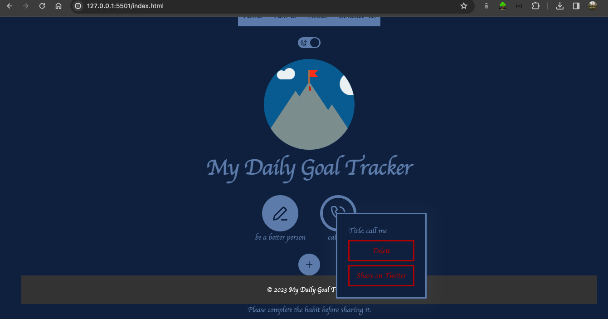

[My Daily Goal Tracker](https://mkothm.github.io/goal-tracker-app/) 

My Daily Goal Tracker is an app designed to help you set, manage, and achieve your daily goals efficiently. It provides a simple yet effective way to organize your goals and track your progress.

## Features

- **Create Goals:** Create and name your daily goals.
- **Goal Icons:** Choose icons to represent your goals.
- **Track Progress:** Track completion progress for each goal.
- **Goal Management:** Delete goals when they are accomplished.
- **Personalization:** Switch between different themes for a personalized experience.

## Usage

1. **Home Page:** Start by visiting the Home page.
2. **How To:** Refer to the "How to" page for a guide on using the app effectively.
3. **Contact Us:** For any queries or feedback, feel free to contact us through the provided contact information.

## Installation

1. Clone this repository.
2. Open the index.html file in your web browser.

## Contact Information

For any inquiries or assistance, please contact [mkalbani96@gmail.com](mailto:mkalbani96@gmail.com).

## Contributing

Contributions are welcome! Feel free to fork this repository and submit a pull request.

